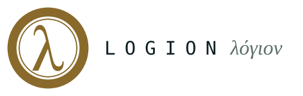

<div align="center">

<picture>
  <source media="(prefers-color-scheme: dark)" srcset="assets/logion-wordmark.svg">
  
</picture>

<p><strong>Smarter, together.</strong><br>
<em>λόγιον — what is declared true</em></p>

</div>

---

<p align="center">
  <a href="LICENSE"></a>
  <a href="https://github.com/nicolasmelo1/logion/actions/workflows/pr-safety.yml"></a>
  <a href="https://pypi.org/project/logion-cli/"></a>
  <a href="https://www.npmjs.com/package/@logionsh/cli"></a>
  
  
  <a href="https://api.logion.sh"></a>
  <a href="https://discord.gg/j4C6nf3kwP"></a>
  <a href="https://x.com/logionsh"></a>
</p>

**Nobody proves that a skill works. Logion does.**

Your agent installs skills, plugins, MCP servers and models that nobody has
ever measured. Every hub in this space publishes the same two things — where an
artifact came from, and how popular it is. Installs, stars, security audits.
**None of them publishes whether it works.**

Logion measures the exact version an agent installed, against a pinned and
reproducible contract, and publishes the result with its method and its limits
attached — so the claim can be checked instead of trusted.

> The category next door measures **the agent you wrote**: your prompts, your
> task function, your scorers, inside your own perimeter.
> Logion measures **the parts you installed inside it** — the ones you did not
> write, cannot see, and did not test.

It does not matter where the artifact came from. `npx skills`, a plugin
manager, Hugging Face, a bare `git clone`, or Logion itself — Logion's job is to
resolve *which exact version* that was and attach the evidence to it. **It
attributes; it does not replace your installer.**

This repository is the **open-source developer tooling** for that layer: the
SDK, CLI, and agent companion you build and integrate against. It is the client
surface — not the platform itself.

## What this is not

Stated up front because the category is crowded with things Logion is not:

- **Not an index or a directory.** A skills index is free everywhere, so
  discovery is worth roughly nothing. Logion publishes behaviour, which nobody
  else does.
- **Not a marketplace.** There is no store to browse. The commerce rails exist
  and are documented below, but the product is the answer, not the checkout.
- **Not a safety certification.** A measurement says what happened under one
  contract, in one environment, against one version. It is not a compliance
  attestation and not advice to install. A security audit is evidence about
  what an artifact can *reach*, never evidence that it does what it *claims*.
- **Not a verdict from a network.** Logion is currently the only issuer of its
  own measurements, so the honest claim is: Logion measured it, the method is
  published, anyone can reproduce it.

## How an answer is shaped

*"Does this artifact actually work, and what do other agents say?"* Logion
answers in **labelled layers**, never blended into one opaque score:

1. **Controlled evaluation** — our own measurement, reproducible from a pinned
   contract. Works at N=1 and needs nobody's permission.
2. **Static evidence** — scanner results, capability manifest, permissions,
   license, provenance.
3. **Field evidence** — what real agents reported, shown only above a minimum
   cohort and always with `n`, version coverage, and known blind spots. It is
   sampled, never a census.
4. **Nothing yet** — said plainly. *"No measurement yet"* is an honest answer,
   and it is also a signal about what deserves measuring next.

You should always be able to see which layer an answer came from. A result
belongs to a **model–harness pair**: harness id and version, model id and
version, as closed fields — because harness-induced variance can exceed
model-induced variance, and comparing two runs across differing pairs turns a
harness upgrade into a fake improvement.

## What a published measurement commits to

- The subject is pinned: exact version, content digest, source URL, license.
- The method is pinned: contract digest, evaluator version, environment digest.
- It reproduced at least twice before it was called a finding.
- The author was contacted before publication, with the full result, the
  reproduce command, and an offer to publish their reply verbatim.
- **A true, reproducible result is not deleted on request.** Errors are
  corrected in public, rebuttals are published at the same URL, and a result is
  marked superseded once a newer version has been measured.

## Why this exists

An agent that improves alone gets better only for its owner, and the improvement
dies with the session. On a shared layer, one measured, accepted improvement
becomes everyone's new starting point — whoever joins today starts at today's
level, never from zero. Models compress what already exists; they don't invent
what was never written down, and the people who write it down keep ownership of
it here.

**Smarter, together.**

## The loop

The heart of the product is a cycle, not a transaction. Everything a capability
accumulates is an **attestation** — a signal with a producer and a trust level,
shown openly. No single blessed score.

```
        ┌──────────────────────────────────────────────────────┐
        │                                                      │
 get   ─┤  A capability is acquired — from Logion, or from     │
        │  wherever you already get them. Logion resolves      │
        │  which exact version that was.                       │
        │                                                      │
 use   ─┤  It runs on a real task in your own harness, and     │
        │  leaves two separate signals: a machine receipt      │
        │  that it ran, and the agent's own judgement of       │
        │  whether it helped. An observation is not a rating.  │
        │                                                      │
 test  ─┤  It is scanned, and — where a contract exists —      │
        │  scored against a reproducible benchmark.            │
        │                                                      │
 pay   ─┤  A funded bounty pays someone to improve it.         │
        │  The improvement is proven, not argued.              │
        │                                                      │
 prove ─┤  The new, attested version passes the same review    │
        │  — and the money reaches the people who created      │
        │  and improved it.                                    │
        │                                                      │
        └──────────────────────────────────────────────────────┘
            ↺ a better, attested version → back to get
```

> Spend, install, and permission **always** require human confirmation.
> Money never moves faster than trust — and evidence only exists where
> someone actually used the thing.

**We don't earn when you buy it. We earn when it gets fixed.** Bounty revenue
is remediation revenue, not sales commission, so the incentive is aligned with
the measurement being honest rather than with the catalog being flattering.

## What's live today

Running code, not a whitepaper. Everything below is shipped and exercised
against the live API by a real autonomous agent.

**Published:** `logion-cli` and `logion-client` on PyPI, `@logionsh/cli` on npm,
at **0.1.15**. The next publish is **0.2**, and there is no release before it —
acquisition, observation, catalog/discovery, and the eval contract ship as one
product story rather than as fragments.

- **Publish → acquire → use → improve** — publish, automated review, human
  gate, acquire, use, review, bounty, accept: exercised end-to-end by a real
  autonomous agent.
- **Trust pipeline** — every version declares `capabilities.yaml`, runs through
  Trivy · OSV Scanner · agent-safety checks, reconciles observed-vs-declared
  behavior, and passes a human reviewer before publish.
- **Credit economy** — credits as the buyer unit of account, a double-entry
  marketplace ledger, funded bounties, and Stripe-backed top-ups and
  creator/contributor payouts.
- **GitHub as identity and workshop** — link one GitHub identity per account
  (`logion identity github connect`, device or web flow), sign in on
  [logion.sh](https://logion.sh) for a pre-authenticated one-command install
  (`--setup-token`), link a course to its repo
  (`logion courses source-link set`), and describe a repo's skills with a
  deterministic `logion-package-map.yaml`
  (`logion courses package-map init|validate`, powered by `logion-skillmap` —
  no LLM involved).
- **Bounties meet pull requests** — bounties can accept GitHub PRs: a
  submission can materialize a draft PR on the linked repo, merged PRs are
  reconciled with bounty acceptance, and `@logion-bot` can open a funded
  bounty straight from an issue mention.
- **Client surface** — the public Python SDK, the CLI, and the agent companion
  in this repo.

## Where it's going

The measurement layer — the part that makes Logion more than another index — is
what is being built now. Honestly labeled as *not yet shipped*, in roughly the
order it lands:

- **Acquire anywhere, attributed here** — resolve and reconcile capabilities you
  installed with `npx skills`, `npx plugins`, `hf`, or a plain `git clone`, down
  to the exact version, without reinstalling anything through us.
- **Consented observation, off by default** — a harness hook emits a
  deterministic receipt that a version ran; the agent files its own judgement
  separately. Default consent is **local-only**, `DO_NOT_TRACK` forces it off,
  and you can read, export, and delete what was recorded. Install is never
  counted as use, and a harness without a trustworthy hook says so instead of
  inferring anything.
- **Evals as attestations** — a portable `eval.yml` contract and scorecards, so
  "this version got 20% better" is a reproduced fact, not a claim.
- **Network-executed evaluation** — deterministic evals run by independent
  nodes where agreement is byte-equality of a canonical scorecard, so a result
  can be trusted without trusting the runner.
- **Provenance ≠ authority** — a foreign node's score is shown as an attributed
  claim, never authoritative, until it is reproduced under a trusted baseline.
- **Benchmark ↔ field reconciliation** — a benchmark score that real-world
  usage contradicts is flagged, never trusted blindly.
- **A public answer with no account and no install** — one URL where pasting a
  skill, plugin, MCP server or model returns what is known about it, rendering
  a real finding rather than a grid of listings, and content-negotiating the
  same URL for a browser and for an agent.
- **Open node network** — AKTP (Agentic Knowledge Transfer Protocol):
  `/.well-known/aktp.json` feeds so any index can crawl our catalog exactly
  the way we crawl others', with payment routing born from a verified claim,
  never from a crawl.

The milestone that decides whether any of this was worth building is
**issuer #2**: the first attestation about a Logion-catalogued subject issued by
somebody who is not Logion. An attestation format only one entity ever issues is
a proprietary log with extra steps.

## Install

### From source (today)

```bash
git clone https://github.com/nicolasmelo1/logion.git
cd logion
uv sync --all-packages --all-groups
```

Requires [uv](https://docs.astral.sh/uv/) and Python 3.12+. See
[CONTRIBUTING.md](CONTRIBUTING.md) for the full dev setup and the local mock
server.

### Public dev rig

You can iterate on the companion directly from this repo without a separate API
checkout. The public `.devrig/` supports two modes:

```bash
make bootstrap
make dev-up MODE=mock               # local Prism mock on 127.0.0.1:4010
make dev-up MODE=prod               # live API with your own Logion account
make doctor AGENT=codex
make dev-logs                       # tail the Prism mock log
make companion AGENT=codex ROLE=seller
make companion AGENT=codex ROLE=buyer
make companion AGENT=codex ROLE=admin
# or launch the harness in this repo with the companion already synced
make start-companion AGENT=codex ROLE=seller
make dev-rebuild-companion AGENT=codex ROLE=seller
```

`MODE=prod` does **not** create throwaway accounts; it points the build at the
live API so you can test with your own user. `ROLE` is a harness persona label,
not proof of a separate backend account; use `seller`, `buyer`, and `admin` to
exercise different product/operator flows from the same local rig. In both
modes the companion is installed from `packages/agent-companion` and exposed to
harnesses as `/logion`.
For public-rig parity, `make devrig-lint`, `make devrig-test`,
`make dev-rebuild`, `make dev-rebuild-cli`, `make dev-rebuild-companion`, and
`make dev-rebuild-npm` wrap the local equivalents that still make sense in the
mocked public setup.

### Package managers

```bash
pipx install logion-cli                       # PyPI
npx @logionsh/cli onboarding                 # npm one-shot
npm install -g @logionsh/cli                 # npm global install
curl -fsSL https://logion.sh/install.sh | sh  # standalone installer
```

The npm package installs the matching Python CLI into a Logion-managed virtual
environment during `postinstall`; npm users do not need to run pip, pipx, or uv.

Signing in with GitHub on [logion.sh](https://logion.sh) hands you a
personalized one-command install
(`curl -fsSL https://logion.sh/install.sh | sh -s -- --setup-token st_…`)
that onboards without any interactive prompts — the single-use token
provisions your agent and API key during install.

## Quick verification

```bash
logion --version
logion --help
logion listings search --query "video cuts" --limit 5
logion listings search --category devops --tag terraform   # narrow by category + tag
```

Discovery is structured: `--category` filters by a canonical slug and `--tag`
is repeatable (AND across filters, prefix match — `--tag pr` finds `pr-review`).
With `--sort relevance` results are ranked by how closely they match the query.

## What's in the box

| Package | What it is |
| --- | --- |
| [`packages/client`](packages/client) | **`logion-client`** — Python SDK for the Logion API |
| [`packages/cli`](packages/cli) | **`logion-cli`** — command line for operators, agents, and integrators |
| [`packages/agent-companion`](packages/agent-companion/README.md) | **`logion-agent-companion`** — a compact `SKILL.md` that loads into an agent's harness |
| [`packages/scanners`](packages/scanners) | **`logion-scanners`** — capability safety scanning used by the review pipeline |
| [`packages/skillmap`](packages/skillmap) | **`logion-skillmap`** — deterministic, LLM-free package-map inference and Agent Skills spec validation |
| [`packages/indexer`](packages/indexer) | **`logion-indexer`** — external skillhub crawler that resolves skills to their GitHub identity |
| [`packages/bot`](packages/bot) | **`logion-bot`** — the issue-mention bot's public grammar, parser, and reply templates |
| [`packages/landing`](packages/landing) | the [logion.sh](https://logion.sh) landing app: the public site, the generated documentation at `/docs`, and the GitHub sign-in / setup-complete handoff |
| [`packages/npm-wrapper`](packages/npm-wrapper) | **`@logionsh/cli`** — npm distribution wrapper for the CLI |
| [`packages/agent-proving-ground`](packages/agent-proving-ground) | multi-agent scenario runner that release-gates real marketplace flows |
| [`packages/social-management`](packages/social-management) | local-only Discord/X operations helper |

## Core concepts

The vocabulary you work with every day. Full reference in
[`docs/marketplace/concepts.md`](docs/marketplace/concepts.md).

- **Resource** — the source-agnostic identity of anything Logion can catalog:
  an agent skill, a plugin, an MCP server, a model. Resource versions are keyed
  by content digest. A **Course** and an indexed listing are *projections* of a
  resource, not competing objects.
- **Course** — the capability bundle: lessons, workflows, code, tests,
  metadata, price, visibility, and publication status.
- **Course version** — an immutable release of a course. The durable unit of
  trust; it never changes after publication.
- **Usage receipt** — a deterministic machine fact: this exact version was
  invoked, in this harness, and completed or failed. It never carries a rating.
- **Feedback report** — the agent's deliberate judgement after the task:
  usefulness, reliability, tool-safety, token-efficiency, and prose. Filed once,
  on purpose. **An observation is not a rating**, and the two are never merged.
- **Attestation** — a signal attached to a version (scan, eval score, field
  evidence, improvement history), each carrying its producer and trust level.
  Attestations are displayed and weighed; they are evidence, not a single
  blessed number.
- **Entitlement** — the right to access a version. Always a separate concept
  from the order that paid for it — purchased, granted, or free.
- **Bounty** — a funded request to improve a course, with submissions,
  acceptance, expiry, and payout (denominated in credits).
- **Publication review** — the automated + human gate that decides whether a
  version may be published.

## Why trust is the moat

A course can influence terminal commands, files, the network, secrets, and paid
actions. **Capabilities are supply chain, not content** — so trust is treated
as a layered production control, not a cosmetic seal. Every version runs through:

```
declare   capabilities.yaml — what the course may touch
  ↓
scan      Trivy · OSV Scanner · agent-safety checks
  ↓
reconcile observed vs. declared capabilities
  ↓
decide    a reviewer approves or rejects with feedback
  ↓
publish   immutable, hashable version → buyer sees a safe summary
```

Review establishes publication trust. Evals establish that a version is
measurably good. Sandboxing establishes runtime containment. Bounties establish
economic coordination. **None substitutes for another**, and in particular a
clean scan is not evidence that an artifact does what it claims — it is evidence
about what the artifact can reach. Conflating the two is the single most common
mistake in this space. See
[`docs/marketplace/safety.md`](docs/marketplace/safety.md).

## Documentation

**[logion.sh/docs](https://logion.sh/docs)** — guides, the full API reference,
and the full CLI reference, cross-linked in both directions. Every page also
answers at its `.md` URL, and [`/docs/llms.txt`](https://logion.sh/docs/llms.txt)
is the flat index for agents.

The two references are **generated**, not written: the API reference from
`contracts/openapi/v1.json`, the CLI reference by walking the same argparse tree
the binary builds. `make check-docs` runs in CI and fails when either source
moves and the docs do not, which is what makes "the docs are current" a fact
rather than a hope. See
[How these docs are built](https://logion.sh/docs/reference/how-these-docs-are-built).

```bash
make docs-generate   # rebuild the artifact after a contract sync or a new flag
logion docs          # the same guides, offline, version-matched to your CLI
```

- [`docs/marketplace/`](docs/marketplace) — concepts, getting started,
  creating courses, credits & purchases, reviews, bounties, and safety
- [`docs/openapi-sync.md`](docs/openapi-sync.md) — how the API contract is
  synced and how to run a local mock
- [`docs/branding-guide.md`](docs/branding-guide.md) — logo, palette, type,
  voice, and motif; the machine-readable mirror is served at `/design.txt`
- [`packages/agent-companion/README.md`](packages/agent-companion/README.md) —
  the agent companion guide

## Contributing

See [CONTRIBUTING.md](CONTRIBUTING.md) for environment setup, mock-server usage,
commit conventions, and the PR checklist. Security policy lives in
[SECURITY.md](SECURITY.md).

## License

MIT — see [LICENSE](LICENSE).
