# Release Pipeline

This document describes the automated release pipeline for Logion packages.
A single git tag push triggers a coordinated workflow that builds, publishes,
and verifies each release.

## Pipeline Overview

```mermaid
flowchart TD
    subgraph CLI["logion-cli-vX.Y.Z"]
        A1["release-cli.yml"] --> A2["release-npm.yml"]
        A2 --> A3["regenerate-manifest.yml"]
        A3 --> A4["release-conformance.yml"]
    end

    subgraph Client["logion-client-vX.Y.Z"]
        B1["release-client.yml"] --> B2["regenerate-manifest.yml"]
        B2 --> B3["release-conformance.yml"]
    end

    subgraph Companion["logion-companion-vX.Y.Z"]
        C1["release-companion.yml"] --> C2["regenerate-manifest.yml"]
        C2 --> C3["release-conformance.yml"]
    end

    subgraph Installer["installer-vN"]
        D1["release-installer.yml"]
    end
```

Each tag push triggers exactly one pipeline branch. The CLI tag is unique in
that it fans out to npm after the PyPI publish completes.

## Tag → Workflow Routing

| Tag pattern | Triggered workflows (in order) |
|---|---|
| `logion-cli-v<X.Y.Z>` | `release-cli.yml` → `release-npm.yml` → `regenerate-manifest.yml` → `release-conformance.yml` |
| `logion-cli-v<X.Y.Z>-rc.<N>` | `release-testpypi.yml` only (no npm, no manifest, no conformance) |
| `logion-client-v<X.Y.Z>` | `release-client.yml` → `regenerate-manifest.yml` → `release-conformance.yml` |
| `logion-companion-v<X.Y.Z>` | `release-companion.yml` → `regenerate-manifest.yml` → `release-conformance.yml` |
| `installer-v<N>` | `release-installer.yml` only |

## Workflow Details

### release-cli.yml

Triggered by `logion-cli-v*` tag push. Verifies the tag matches
`pyproject.toml` version, builds wheel + sdist, publishes to PyPI via
OIDC Trusted Publishing (environment: `pypi`), and attaches artifacts
to the GitHub Release.

### release-npm.yml

Triggered by `logion-cli-v*` tag push (runs in parallel with
`release-cli.yml`). Pins the CLI version from the manifest, builds the
npm wrapper, and publishes to npm with provenance (environment: `npm`).

### release-client.yml

Triggered by `logion-client-v*` tag push. Same pattern as
`release-cli.yml` but for the SDK package.

### release-companion.yml

Triggered by `logion-companion-v*` tag push. Builds the companion
skill bundle and attaches it to the GitHub Release with SHA256SUMS.

### regenerate-manifest.yml

Triggered by `workflow_run` after any release workflow completes
successfully. Rebuilds `manifest-stable.json` and
`manifest-latest.json`, then opens a PR targeting `main` if the
manifests changed.

### release-conformance.yml

Triggered by `workflow_run` after any release workflow completes
successfully. Verifies that the manifest matches what is published on
PyPI, npm, and GitHub Releases. Exits 1 on any mismatch.

### release-installer.yml

Triggered by `installer-v*` tag push. Computes SHA256 hashes for
`install.sh` and `install.ps1`, then attaches all installer assets to
the GitHub Release.

## See Also

- [RELEASING.md](../RELEASING.md) — operator runbook for cutting and
  rolling back releases.
- [docs/installer.md](installer.md) — installer architecture and
  redirect setup.